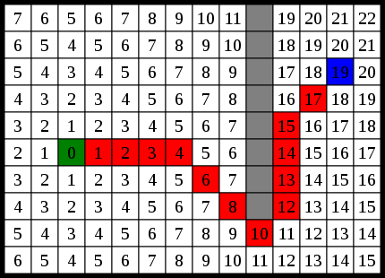

# Pathfinding

I worked on a pathfinding algorithm for a test on Kattis website for Paradox Interactive. After my result got validated, I improved it in order to reduce the execution time and get it below the lowest discussed by other candidates. 

This solution is a modified A* algorithm with optimisations for the detection of neighbours and data types